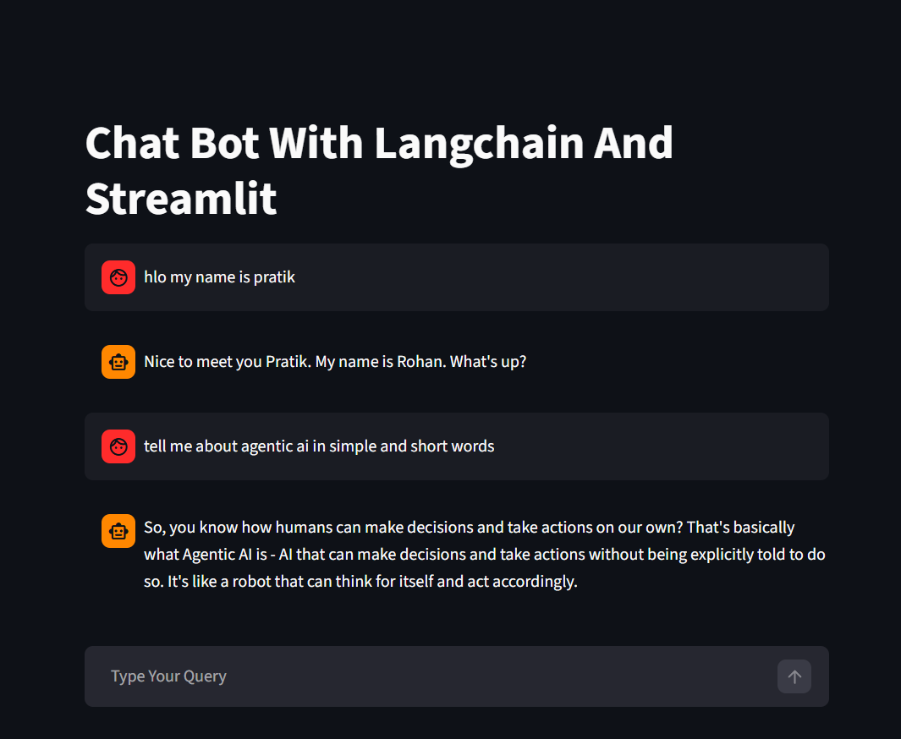

# 🤖 LangChain Groq Chatbot

A simple AI chatbot built using **LangChain**, **Groq LLaMA3**, and **Streamlit**.

## 🚀 Features
- Chat with AI in real-time
- Uses Groq LLaMA3 model
- Streamlit web interface
- Deployed on Streamlit Cloud

## 🖼️ Demo Screenshot



## 🛠️ Tech Stack
- Python
- Streamlit
- LangChain
- Groq (LLaMA3)

## ▶️ How to Run Locally

```bash
pip install -r requirements.txt
streamlit run main.py
